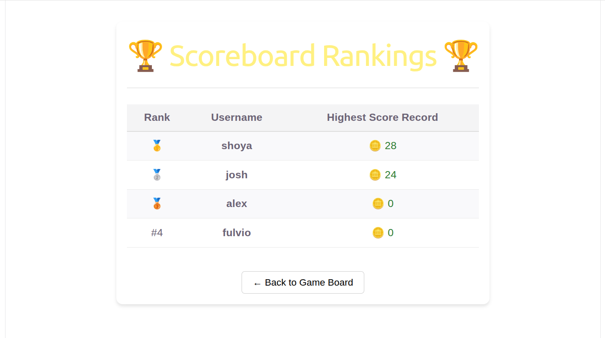
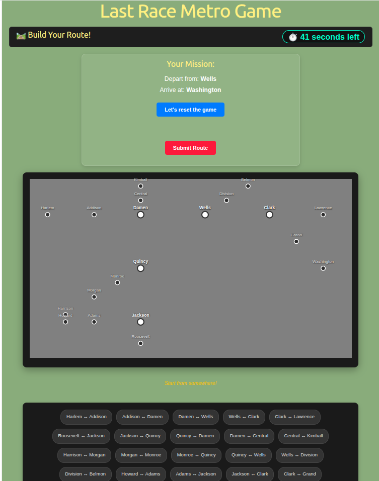

# Exam #1: "Last Race"
## Student: s358411 SHOYA ALIMI 

# Server-Side

## API Server

# a

- Route `/login`: Used for logging in(username, password), and sending back the details of the user(id, name, highest score)
- Route `/logout`: User logs out, and then the cookie is reset 
- Route `/scores`: Used for the scoreboard component, showcasing all users scores (gets the username and the highest scores, showcasing them based off of their highest submitted scores in a decreasing order)
- Route `/user`: assigns the current user to a useState variable with the POST method (receiving all the details of that user in response)
- Route `/updateScore`: By getting user credentials(from req.user), it updates the current user's highest score with the PUT method(returning the new highest score)
- Route `/game-details`: Responsible for receiving the entirety of stations, segments and the events that are going to occur from the database, and then return it as a single key within an object(gameDetails, which includes stations, segments and events)
- Route `/map-layout`: Receiving map details from the servers in order to be used later by the MetroMap component later(getting the stationCoordinates and metroLines in response to be used in MetroMap)
- Route `/generate-route`: The server would generate a proper route(by generateRoute), and validate it itself(with assignRoute, which uses calculateDistance) to ensure a minimum distance of 3(which, if valid, returns the proper start and end stations)
- Route `/submit-route`: User submits their route(sending their chosen segments, actual start and end destinations and their user credentials), and the server returns proper messages and details regarding the segments the user chosen(if it is valid or not, their chosen routes, their current score and maybe a new high record)

# b

- database table `users`: Contains(id, username, password_hash, highestScore) Defining users to have usernames, passwords to login in order to be used later for cookies, and a highest score number to compete with others
- database table `stations`: Contains(id, name) Initial definition of the list of all stations, with their id and name, to later be used by the server to assign and generate a proper route
- database table `segments`:Contains(id, from_station_id, to_station_id) Mapping track connections by directly linking adjacent stations together, and it is used in metroSegments to make sure the selected segments are neighbors 
- database table `events`:Contains(id, name, value) The random events that occur during route playback, and each row maps an event title (name) to a reward or penalty cost (value). When a player executes a journey, the backend selects from this table to calculate random card effects
- database table `lines`:Contains(id, name, color) Categorizing transit network into different routes based off of their colors(for showcasing purposes within the MetroMap component)
- database table `map_stations`:Contains(id, name, x, y) The definition of each station, plus their given coordinates, used in MetroMap component
- database table `line_stations`:Contains(line_id, station_name, station_order, ) The table responsible for connecting the "lines" and "stations" tables, tracking the exact path, also used in MetroMap component
 

---

# Client-Side

## Main React Components and Routes

### 1. React Application Routes

* Login Screen (`currentScreen === 'login'`): The initial landing view, handling user session checks and authentication forms
* Game Screen (`currentScreen === 'game'`): The primary interface where active gameplay occurs. Depending on the `gamePhase` state, it handles three sub-views:
  * Setup Phase (`gamePhase === 'setup'`): Displays the full network map with operational lines active, allowing players to get familiar with the layout
  * Planning Phase (`gamePhase === 'planning'`): Hiding lines and starting a timer. The user interacts with the network by choosing map segments to construct a path from the start station to the destination station
  * Execution Phase (`gamePhase === 'execution'`): Replays the user's selected route step-by-step, displaying real-time events and calculating the final coin score
* Scoreboard Screen (`currentScreen === 'scoreboard'`): Fetches global player records dynamically from the backend database to display top scores
* Instructions Screen (`currentScreen === 'instructions'`): Showcases the core gameplay mechanics, phase transitions, and route validity rules

### 2. Main React Components

* `App` (`App.jsx`): The core root component of the client-side application, managing the primary global states (authentication state, map layout coordinates, game phases, timers, and route logs). It also fetches initial layout configurations from the backend API and implements a React Context (`GameContext`) to distribute map states down the component tree without prop-drilling
* `Login` (`login.jsx`): Handles the presentation layer for user entry. Saving credentials, interacts with backend authentication endpoints, and triggers callbacks after a successful login
* `MetroMap` (`metro.jsx`): A dynamic UI that renders the entire transit map. It uses `GameContext` to automatically track layout updates. It conditionally draws operational transit paths based on the current game phase and maps out clickable nodes representing train stations
* `Scoreboard` (`Scoreboard.jsx`): A component accepting ranking arrays via props. It renders a formatted leaderboard table showing high scores

---

# Overall

## Screenshot

  

  

## Users Credentials

- shoya, 12345
- josh, 12345
- alex, 12345
- fulvio, 12345

## Use of AI Tools
- While working on the project, I mainly used Google's Gemini.

- - While developing return sections of different components, the majority of the CSS was done with the help of AI, espesifically with a file like metro.jsx with the MetroMap component.

- - Also, while implementing my own algorithm for route validation, i used AI as well because there were some minor issues

- - for database and tables, I did some research on the internet and implemented my codes, but whenever there wasn't enough resources brought into the front-end from the backend to be used by the front-end components, AI recommended additional ways as well.

